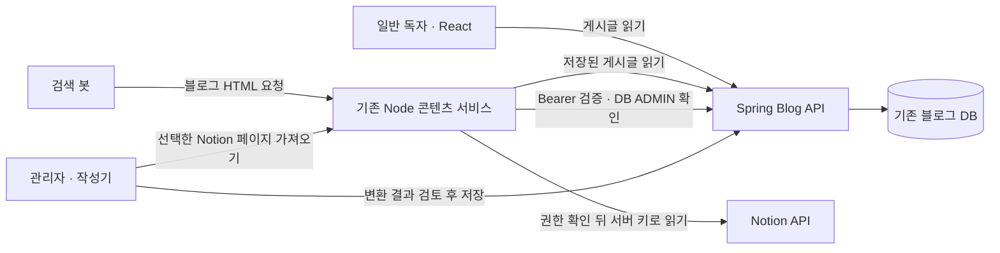

# 블로그 HTML·Notion 변환 서비스

2026-09-14 로컬 구현 기준. 운영에 배포하지 않았다.

## Node 도입 이유와 현재 역할

Node를 도입한 주된 이유는 공식 JavaScript SDK인 `@notionhq/client`와 npm의 Notion 블록 변환·렌더링 라이브러리를 편리하게 활용하기 위해서였다. 사용자가 확인한 도입 의도이며 기존 소스에서도 SDK, `notion-to-md`, `@notion-render/client`를 함께 사용했다. Notion 응답 구조를 직접 다루는 구현·유지보수 범위를 줄이려는 선택이다.

각 라이브러리의 역할은 다음과 같다. `@notionhq/client` 자체는 API 요청·응답과 관련 도우미를 제공하는 클라이언트이며 HTML 렌더러는 아니다. [Notion 공식 SDK 문서](https://github.com/makenotion/notion-sdk-js#usage).

| 라이브러리 | 역할과 사용 범위 |
| --- | --- |
| `@notionhq/client` | 공식 Notion API 클라이언트. 기존·현재 코드에서 페이지·DB·블록을 조회한다. |
| `notion-to-md` | 조회한 Notion 블록을 Markdown으로 변환한다. 기존·현재 가져오기에서 사용한다. |
| `@notion-render/client` | 기존 코드에서 Notion 블록의 HTML 렌더링에 사용했다. 현재 가져오기의 HTML은 변환한 Markdown을 공통 블로그 렌더러에 전달해 생성한다. |

현재 Node는 공식 SDK·변환 라이브러리와 블로그 HTML 응답을 함께 담당한다. React는 작성과 독자 화면을, Spring은 인증·게시글 저장을 맡는다. 이 npm 생태계를 활용하는 장점과 별도 프로세스의 메모리·운영 비용을 함께 평가해야 한다. t3.small을 고려한 이번 변경은 기존 서비스를 유지하면서 인증 경계와 요청·캐시 상한을 보완했다.

CORS 처리는 이 구성의 연결 조건 중 하나다. CORS만을 해결하려고 Node를 도입했다거나 기존 선택이 불필요했다는 설명으로 축약하지 않는다. 현재 봇/일반 사용자 분기를 유지하며 검색 성과를 검증한 것은 아니다.

작성기→Node는 동일 출처 프록시를 사용하는 상대 경로다. 인증 경계는 CORS나 Origin 문자열이 아니라 Bearer 토큰과 Spring의 DB 관리자 역할 검사다. 위 그림은 요청·저장 흐름이며 컨테이너·DB를 새로 배포한 구성도가 아니다.

## 읽기와 가져오기

- `/blog/:id`: 숫자 ID 검증 후 Spring의 저장된 글을 읽는다. 같은 글의 진행 중 요청을 공유하고, 내용·수정 시각·출처가 같은 HTML만 재사용한다. 글 읽기는 Notion을 호출하지 않는다.
- `/sitemap.xml`: Spring의 ID·시각 projection만 사용한다. 실패할 때 전체 게시글 본문을 순회하는 fallback을 제거했다. `/robots.txt`와 기존 글 주소는 유지한다.
- `/notion/*`: Spring `/api/users/me`에서 `ADMIN`을 확인한 뒤만 허용한다. 서버 `NOTION_API_KEY`만 사용하고 브라우저 헤더·본문·쿼리의 키를 거절한다. SDK와 변환기는 관리자 요청 시 지연 로드한다.
- `/notion/render-db/:id`: 페이지 제목·ID 등 목록 메타데이터만 반환한다. 여러 데이터 원본이 있으면 선택을 요구한다. 페이지네이션 뒤 선택한 글만 `/notion/convert`로 변환한다.
- `/seo/preview`: 옛 클라이언트 호환을 위해 URL의 호스트 정보만 반환한다. 임의 URL·DNS·이미지·파비콘을 조회하지 않는다. 링크 카드는 저장된 제목·설명을 사용한다. `/seo/ping`은 410을 반환하며 검색 엔진으로 요청하지 않는다.

Notion은 명시적 `2025-09-03` 계약을 사용한다. SDK v4의 일반 request 기능으로 데이터 원본을 조회하며, 데이터 원본이 해당 DB에 속하는지 검사한다. [Notion 2025-09-03 이전 안내](https://developers.notion.com/guides/get-started/upgrade-guide-2025-09-03).

## 작은 서버를 고려한 상한

| 대상 | 로컬 구현의 제한 |
| --- | --- |
| Notion 가져오기 | 동시 2건, 작업 기한 30초, SDK 호출 기한 15초 |
| 한 가져오기의 외부 조회 | 최대 40회, 응답 본문 합계 4MiB, 고정 `api.notion.com/v1/`, 리다이렉트 거부 |
| 변환 입력·출력 | Express JSON 요청 1MiB, 변환된 Markdown UTF-8 1MiB |
| DB 페이지 선택 목록 | 기본 10개, 요청당 최대 20개 |
| Spring 읽기 | 요청 8초, 응답 4MiB, 환경 프록시와 리다이렉트 사용 안 함 |
| 서로 다른 글의 진행 중 SSR 조회 | 최대 8건, 초과 시 503·Retry-After |
| 생성한 HTML 재사용 | LRU 최대 24개, 인코딩된 HTML 합계 4MiB; 큰 항목은 보관하지 않음 |
| 사이트맵 | 단일 출처 60초, 중복 진행 요청 공유, 최대 10,000개 글 |
| Spring 게시글 캐시 | 같은 JVM의 Caffeine 최대 64개, 기록 후 120초; 새 Redis 없음 |

설정 상한은 실제 t3.small의 성능 측정값이 아니다. 응답/HTML 바이트 수와 엔트리 수는 프로세스 RSS·JVM 힙의 상한이 아니며 파싱 객체와 런타임 메모리는 별도다. 새로운 상시 서비스, 대형 작성기 의존성, Ollama나 다른 추론 프로세스는 추가하지 않았다.

## Markdown 호환성

공통 전처리·HTML/URL 허용 정책은 `src/markdown/`에 있다. SPA는 이를 재사용하고 raw HTML 처리 뒤 정제한다. SSR도 같은 태그·속성·URL 계약으로 정제한다. 커스텀 블록의 새 `contentEncoding="html"`은 본문을 한 번만 복원하는 선택적 형식이며 기존 글을 일괄 변환하지 않는다. 기존 제목 fragment와 글 ID를 유지한다.

Notion의 일반 paragraph는 기본 변환기를 쓴다. `notion-to-md` 3.1.9에 paragraph custom transformer를 등록하면 하위 문단 재귀가 생략되는 문제가 있어 등록을 제거했고 실제 변환 회귀로 확인했다.

## 로컬 실행·검증

Spring의 로컬 `editorial` 프로필을 8100에서 먼저 실행한다. 이 디렉터리에서 `npm test`, `npm run start:editorial`을 사용한다. 기본 주소는 `127.0.0.1:3100`이다. 포트가 이미 쓰이면 기존 프로세스를 중지하지 말고 사용하지 않는 `PORT`를 선택한다.

`editorial`은 loopback Spring만 허용하고 `/notion`·`/seo`를 503으로 차단한다. 테스트에서만 가짜 Spring·Notion을 사용해 가져오기 계약을 검증한다. 실제 Notion 키·운영 API로 로컬 테스트하지 않는다.

일반 실행 설정은 `SPRING_BASE`, 선택적 `SITE_ORIGIN`, `NOTION_API_KEY`, `PORT`다. 일반 Spring은 새 JWT 키 설정을 요구하므로 `Spring-Blog/docs/2026-09-14-backend-contract.md`의 호환 변경도 함께 확인해야 한다. 이는 배포 명령이 아니며 운영 프록시·RPG·DB는 이번 변경 대상이 아니다.

테스트는 인증·URL·용량·동시 요청·캐시·sitemap 실패·중첩 Notion 문단·SPA/SSR 계약을 검증한다. 실제 Notion 서비스와의 연결, 운영 MariaDB 실행 계획·잠금, EC2 CPU/메모리·검색 색인은 아직 측정하지 않았다. 전체 통합 결과와 로컬 백업 위치는 상위 작업 공간 `docs/blog-audit/2026-09-14-project-technical-review-final.md`에 기록한다.
